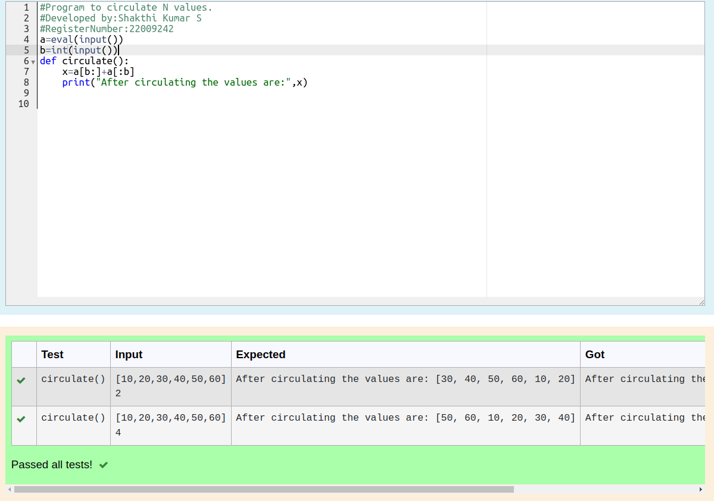

# Circulate-the-values-of-N-variables
## Aim:
To write a python program to circulate the n variables using function concept

## Equipment’s required:
PC
Anaconda - Python 3.7

## Algorithm: 
### Step 1: Define a function named as circulate
### Step 2: Enter the formula to calculate
### Step 3: Get the value from the user for the number of rotation
### Step 4: Using the slicing concept rotate the list
### Step 5: print the values after circulating
### Step 6: End the program
## Program:
```python
#Program to circulate N values.
#Developed by:Shakthi Kumar S
#RegisterNumber:22009242
a=eval(input())
b=int(input())
def circulate():
    x=a[b:]+a[:b]
    print("After circulating the values are:",x)
```

## Output:


## Result:
Thus circulating n variables using functions concept is successfully executed.